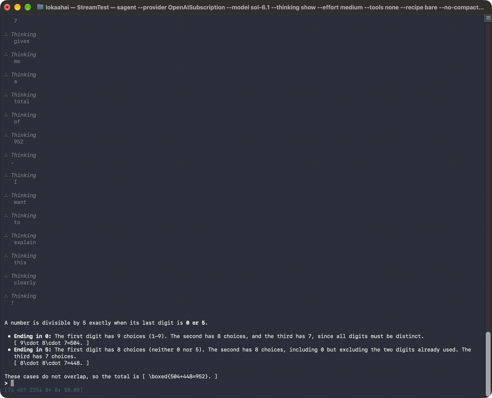
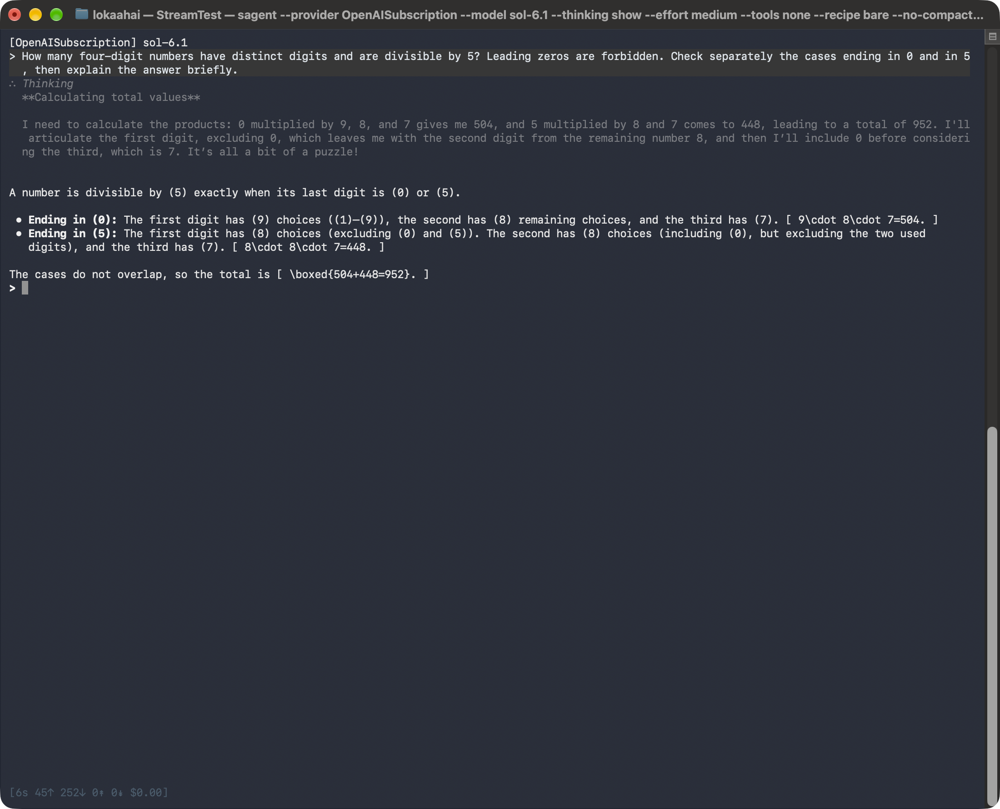

# Live CLI screenshots: reasoning stream rendering

Captured from real macOS Terminal windows on 10 October 2026. PNG files are unedited window captures. These are live model requests through Sagent's interactive CLI, not scripted model replies or renderer mockups.

Baseline: clean upstream `accc0d5837bf6d438d934c321896632687d179bd`.
Patch: `2b5ecf9ac240a8ddf8de35691bbd9248f0a8b2ba`.

Both requests used OpenAISubscription, sol-6.1, medium effort, visible thinking, `--tools none`, `--recipe bare`, fresh sessions, a 2,048-token response ceiling and a $0.20 Sagent budget ceiling. The budget setting is a tool accounting limit, not a claim about subscription billing. No research worker or installed CLI was changed.

Prompt: How many four-digit numbers have distinct digits and are divisible by 5? Leading zeros are forbidden. Check separately the cases ending in 0 and in 5, then explain the answer briefly.

## Before



The Terminal history contains 83 Thinking headings for one 354-character provider reasoning summary. The screenshot shows the bottom of the scrollback, with 14 headings visible. The complete summary is preserved in the history, but fragmented across headings. Both the saved model reply and Terminal output contain the correct final answer, 952.

## After



One Thinking heading contains the full 381-character provider reasoning summary. The saved plain-text summary matches the Terminal readback after removing wrapping whitespace. The interactive prompt emits complete lines and flushes the unfinished tail at the response boundary. Both the saved model reply and Terminal output contain 952.

The prompts and settings match; generated text differs between the two independent model calls. This demonstrates display behavior, not model quality or speed. The displayed text is provider-exposed reasoning or a summary, not a claim to access the model's hidden internal reasoning.

## Validation

Python 3.14.6 on macOS, locked dependencies and the Slack extra. All 214 console, rendering and REPL tests pass. The pre-commit hooks for the five changed files pass. Repository-wide Ruff lint and formatting, Ty, Basedpyright, import, build, wheel check and whitespace check pass.

Default pytest: patched 7,367 passed / 15 failed; clean upstream 7,345 passed / 15 failed, with exactly the same failing node IDs. These failures are in `sagent/lib/worker_count_test.py` (13) and binary-file cases in `sagent/lib/files/grep_test.py` (2). Both runs excluded the same 121 optional tests and skipped 132. Whole-tree codespell reports the same unchanged `pyproject.toml:73: crate` warning on both sources. These checks are not reported as green.

No live calls to child agents or other providers were made. Child rendering is covered by deterministic tests. Linux/Python 3.12 and the complete pre-push test tiers remain for CI and maintainer review.

To reproduce focused checks:

```sh
uv sync --python 3.14.6 --frozen --all-groups --extra slack
uv run --frozen pytest --no-cov sagent/repl/console_pane_test.py sagent/repl/render_test.py sagent/repl/run_repl_test.py
uv run --frozen --group pre-commit pre-commit run --files docs/cli.md sagent/repl/console_pane.py sagent/repl/console_pane_test.py sagent/repl/render.py sagent/repl/run_repl.py
```

Private session tapes, encrypted reasoning blocks, account metadata and local logs are excluded from this branch. This evidence branch is separate from the five-file code PR.
